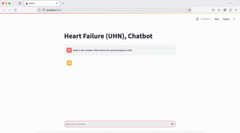

# HF-rag
HF-rag with UI experience for answering HF related questions

Chatbot to interact with HF/HTx waitlist patients to answer questions regarding HTx scripts. First iteration (v1.00)

Uses HNSW for document retrieval and Faiss-CPU for performing operations, matching documents and questions are passed through the GPT-4o-mini to answer the questions.